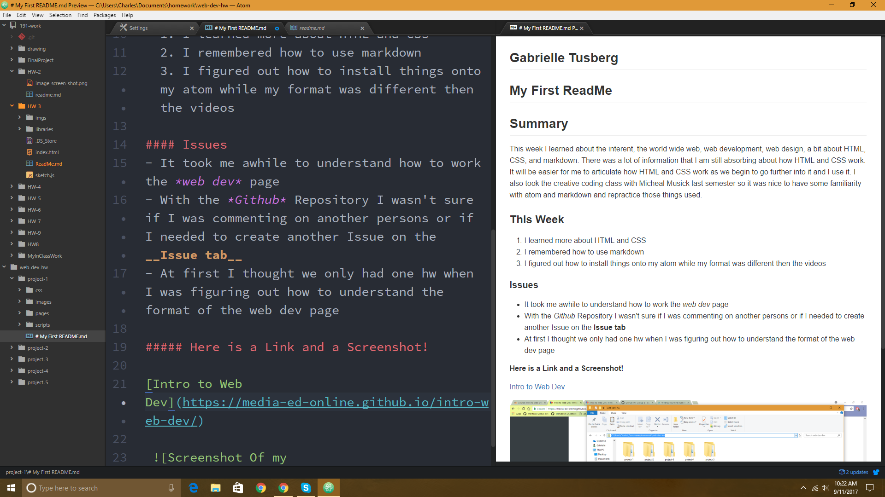

## Gabrielle Tusberg

My First ReadMe
-----

## Summary
This week I learned about the interent, the world wide web, web development, web design, a bit about HTML, CSS, and markdown. There was a lot of information that I am still absorbing about how HTML and CSS work. It will be easier for me to articulate how HTML and CSS work as we begin to go further into it and I use it. I also took the creative coding class with Micheal Musick last semester so it was nice to have some familiarity with atom and markdown and repractice those things used.
### This Week
  1. I learned more about HTML and CSS
  2. I remembered how to use markdown
  3. I figured out how to install things onto my atom while my format was different then the videos

#### Issues
- It took me awhile to understand how to work the *web dev* page
- With the *Github* Repository I wasn't sure if I was commenting on another persons or if I needed to create another Issue on the __Issue tab__
- At first I thought we only had one hw when I was figuring out how to understand the format of the web dev page

##### Here is a Link and a Screenshot!

[Intro to Web Dev](https://media-ed-online.github.io/intro-web-dev/)

 
