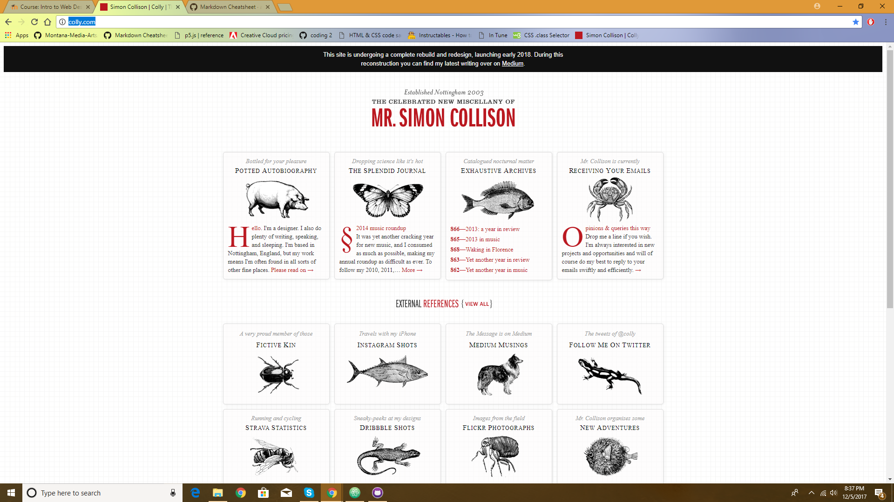

# What is the information this page aims to deliver?

   This page is aimed to make people understand what responsive web design is and why it's important.

## What is the first information on the page that should draw the eye?
The first information on the page I would say is included in the title. The title is siuppose to represent what the website is about while the sub header represents why this will be important. The rest of the information on the page is condensed in all of the boxes.

### What is the primary content of this page? What is the secondary content?

I tried to recreate a website I found while looking for inspiration online. In attempt to manipulate the boxes to be more rounded in their shapes, I struggled making the columb layout.
I initially wanted my colors to be the same colors as seen in the Simon website. #811717, #ffffff, #00000. After I looked up a grah paper img online I adjusted my idea to have my colors mimick the blue lines. Based on the (RWD) format of this website I also did my best to mimick the way the layout changed based on the pages size. I found that the columb flexbox worked the best.
